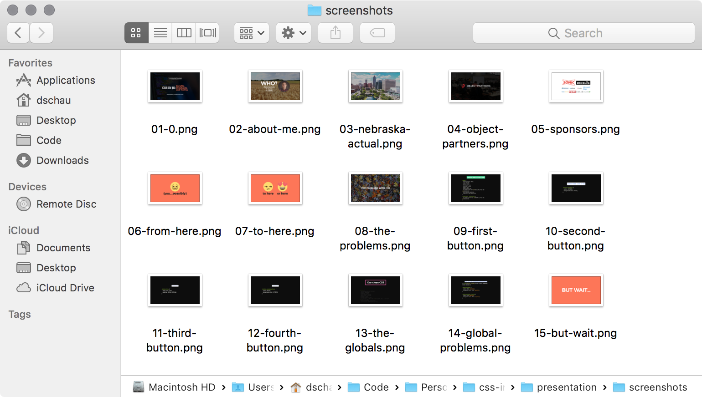

# @screenie/adapter-revealjs

[](https://travis-ci.org/DSchau/screenie)

An adapter to take screenshots of each slide in a revealjs presentation

## Install

```bash
yarn add @screenie/screenie-cli @screenie/adapter-revealjs
```

## Usage

Can be used globally, but I find it most useful to use in a package.json script, like so:

```json
{
  "scripts": "screenie -a adapter-revealjs -u http://localhost:3000 -d 1000 -f screenshots"
}
```

Will take a screenshot of _each_ slide in a revealjs presentation running at `http://localhost:3000`, saving each screenshot in the `screenshots` folder.

Note: slides that use `Appear` will only take a screenshot of the end result *not* each result.

## Example



